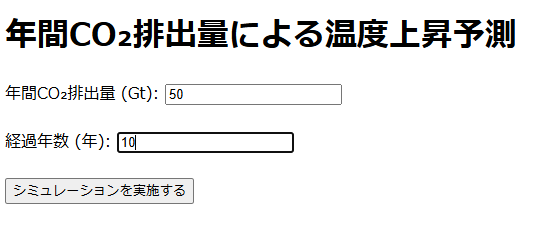
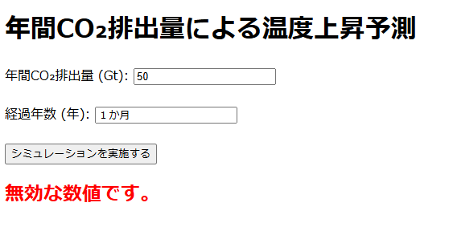

# CO2温暖化シミュレーションアプリ
このアプリは、年間CO₂排出量と経過年数を基に、将来的な気温上昇を予測するシミュレーションツールです。 
ユーザーはCO₂排出量と年数を入力し、温度上昇の予測結果をグラフやCSVやExcelファイルとしてダウンロードできます。

## アプリのデプロイ先
以下のURLでアプリを利用できます：  
https://global-warming-simulation.onrender.com


## アプリのスクリーンショット


### 【メインページ】



### 【グラフの画面】


### 【CSV・Excelダウンロードボタンの画面】


### 【CSVの画面】


### 【Excelの画面】


### 【エラー画面】



## 機能一覧
- CO₂排出量と経過年数を入力し、将来の気温上昇を予測。
- グラフで予測結果を表示。  
- 結果データを **CSV** および **Excel** ファイルでダウンロード可能。  
- エラーメッセージ表示機能（不正な入力の場合）  

## インストール方法

1. リポジトリをクローンします:  
```bash  
https://github.com/TechCat-Hello/global_warming_simulation.git
```

2. 必要なライブラリをインストールします:    
```bash  
pip install -r requirements.txt
```

3. Flaskアプリを起動します。  
```bash  
python app.py
```

4. ブラウザで以下のURLを開きます。
```
http://127.0.0.1:5000
```

## 使い方
1. CO₂の年間排出量（Gt単位）を入力します。
2. 経過年数を入力します。
3. 「送信」ボタンをクリックして予測結果を確認します。
4. グラフやデータをダウンロードする場合、画面下部の「CSV」または「Excel」ボタンをクリックします。

## 動作環境
- Python 3.6 以上
- Flask 2.0
- pandas
- matplotlib
- numpy
- openpyxl
- gunicorn

## License
This project is licensed under the MIT License.  
See the [MIT License](https://github.com/TechCat-Hello/global_warming_simulation/blob/main/LICENSE) file for more details.

## Contributing
私はこのプロジェクトを公開しています。  
もしこのプロジェクトに貢献したい場合は、以下の手順に従ってください：  
1. リポジトリをフォークする   
プロジェクトに貢献したい場合は、まずリポジトリをフォークしてください。  
GitHubでリポジトリのページを開き、右上にある「Fork」ボタンをクリックしてください。  

2. 新しいブランチを作成する    
フォークしたリポジトリをローカルにクローンし、新しいブランチを作成してください。  
例えば、feature/新しい機能 や bugfix/バグ修正 などの名前をつけると良いです。  
```bash  
git checkout -b feature/新しい機能
```

3. コードを変更する    
バグ修正や新機能の追加、改善を行います

4. 変更をコミットする  
変更が完了したら、変更内容をコミットします。  
コミットメッセージは簡潔で、変更内容を説明するものにしましょう。  
```bash  
git add .
git commit -m "Fix issue with temperature calculation logic"
```

5. プルリクエストを作成する  
変更をローカルリポジトリでコミットした後、GitHubの自分のリポジトリにプッシュして、元のリポジトリにプルリクエストを作成します。  
```bash  
git push origin feature/新しい機能
```

6. プルリクエストを送信する  
GitHub上で、あなたのリポジトリのページを開き、「Pull Requests」タブから新しいプルリクエストを作成します。  
説明文も詳しく記載し、変更内容を他の人が理解できるようにしてください。  

## Issueの報告
もしバグを発見した場合や、新しい機能の提案がある場合は、Issues を使って報告してください。  
以下の情報を含めて報告していただけると、より迅速に対応できます：  
- バグの再現手順
- エラーメッセージ（あれば）
- 提案内容や機能追加の理由

## コードスタイル
コードは以下のスタイルガイドに従ってください：  
- PythonのPEP 8スタイルガイドに従う
- インデントにはスペース4つを使用
- 変数名や関数名はわかりやすく意味のある名前を使用

## その他の注意事項
- テスト:   
新しい機能を追加した場合やバグを修正した場合は、テストを追加していただけると助かります。
- レビュー:  
プルリクエストは、できるだけ小さく簡潔にしてください。レビューがしやすくなります。

## 作者
- 名前: TechCat-Hello  
- GitHub: [TechCat-Hello](https://github.com/TechCat-Hello)
- Email: a.m.techcat@gmail.com

## Thank You!
このプロジェクトへの貢献をありがとうございます！  
あなたの貢献がプロジェクトをさらに素晴らしいものにします。


